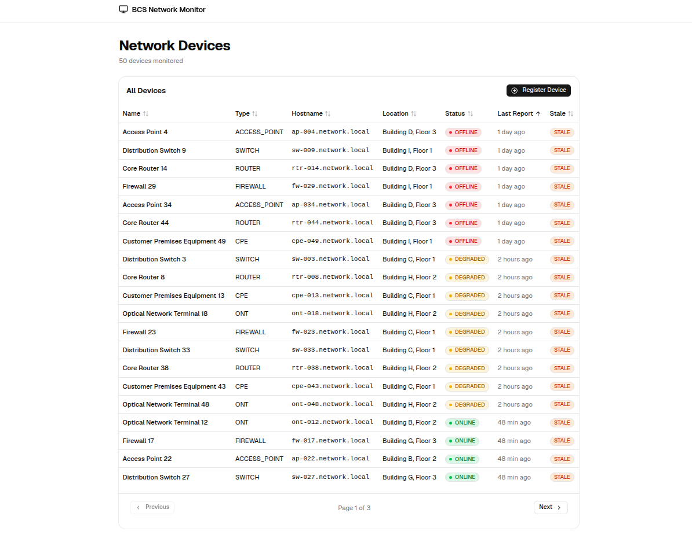

# BCS Network Monitor



A full-stack Network Device Monitoring Service for managing network infrastructure assets and tracking their operational health. Register devices, submit status reports, and monitor which devices are online, offline, degraded, or stale.

## Architecture

```
┌─────────────────┐      HTTP/REST       ┌──────────────────┐      JDBC      ┌─────────────┐
│  React (Vite)   │ ◄──────────────────► │  Spring Boot     │ ◄────────────► │  PostgreSQL │
│  TypeScript     │   port 5173 → 8080   │  Java 26         │                │  Docker     │
└─────────────────┘                      └──────────────────┘                └─────────────┘
```

## Prerequisites

| Tool        | Version  | Required For |
|-------------|----------|--------------|
| Java JDK    | 26       | Backend      |
| Node.js     | 18+      | Frontend     |
| Docker      | 20+      | PostgreSQL   |
| Maven       | wrapper included | Backend build |

## Quick Start

### 1. Start the database

```bash
cd backend
docker compose up -d
```

### 2. Run the backend

```bash
cd backend
./mvnw spring-boot:run
```

The API will be available for the frontend at `http://localhost:8080/api`.

### API Documentation

Interactive Swagger UI is available at **http://localhost:8080/swagger-ui.html** when the application is running.

| URL | Description |
|-----|-------------|
| `/swagger-ui.html` | Interactive Swagger UI |
| `/v3/api-docs` | OpenAPI JSON spec |

### 3. Run the frontend

```bash
cd frontend
npm install
npm run dev
```

The UI will be available at `http://localhost:5173`.

### NOTE

Detailed `README` for Frontend and Backend can be found at:

- Frontend - `frontend/README.MD`
- Backend - `frontend/README.MD`

## API Overview

| Method | Endpoint                        | Description           |
|--------|---------------------------------|-----------------------|
| POST   | `/api/devices`                  | Register a new device |
| GET    | `/api/devices`                  | List devices (paginated) |
| GET    | `/api/devices/{id}`             | Get device detail     |
| POST   | `/api/devices/{id}/status-reports` | Submit a status report |

### Curl Examples

**Register a device:**

```bash
curl -X POST http://localhost:8080/api/devices \
  -H "Content-Type: application/json" \
  -d '{
    "uniqueId": "CPE-001",
    "name": "Customer Premises Equipment 1",
    "deviceType": "CPE",
    "hostname": "cpe-001.network.local",
    "ipAddress": "192.168.1.1",
    "location": "Building A, Floor 3"
  }'
```

**List devices (paginated):**

```bash
curl "http://localhost:8080/api/devices?page=0&size=20&sort=registeredAt,desc"
```

**Get device detail:**

```bash
curl http://localhost:8080/api/devices/1
```

**Submit a status report:**

```bash
curl -X POST http://localhost:8080/api/devices/1/status-reports \
  -H "Content-Type: application/json" \
  -d '{
    "status": "ONLINE",
    "message": "All systems operational"
  }'
```

## Project Structure

```
bcs-network-monitor/
├── backend/          Spring Boot REST API (see backend/README.md)
├── frontend/         React + Vite SPA (see frontend/README.md)
```

## Stale Rule

A device is considered **stale** if it has not submitted a status report within the configured threshold. Devices with no reports are stale by default and show a status of `OFFLINE`.

The threshold is configured in `backend/src/main/resources/application.yaml`:

```yaml
app:
  stale-threshold: 15m
```

Supported formats: `15m`, `1h`, `30s`, `PT15M` (ISO-8601). The default is **15 minutes**.

## Tech Stack

| Layer    | Technology                                                    |
|----------|---------------------------------------------------------------|
| Backend  | Spring Boot 4, Spring Data JPA, Flyway, Lombok, PostgreSQL   |
| Frontend | React 19, Vite 8, TypeScript 6, Tailwind CSS 4, shadcn/ui   |
| Testing  | JUnit 5, Mockito, Testcontainers (backend); Vitest, React Testing Library (frontend) |

## Considerations and Assumptions

| #  | Topic | Assumption / Consideration |
|----|-------|---------------------------|
| 1  | **Authentication** | The system has **no authentication or authorization**. Anyone with network access to the API can register devices and submit status reports. Production deployments should add Spring Security or an API gateway. |
| 2  | **Stale computation** | Staleness is computed **at read-time** by the backend using the configured threshold. There are no background cron jobs or schedulers. The frontend displays the `stale` boolean from the API rather than computing it locally. |
| 3  | **Single database** | The application assumes **PostgreSQL** with a dedicated `network_monitor` schema. Other databases would require Flyway migration and dialect changes. |
| 4  | **Pagination** | Device lists are **paginated** (20 per page, default sort by oldest report first). Status reports on the detail page are limited to the 20 most recent per device. |
| 5  | **Docker for tests** | Integration and E2E tests require **Docker** (via Testcontainers). Tests will skip or fail if Docker is unavailable. |
| 6  | **Local development CORS** | CORS is configured for `localhost:5173` (Vite dev server). Production deployments need updated CORS configuration. |
| 7  | **UTC timestamps** | All timestamps are stored as **UTC** (`Instant`). The frontend formats them using the browser's locale. |
| 8  | **No soft deletes** | Devices cannot be deleted via the API. There is no `deleted_at` column or archival mechanism. |
| 9  | **Unique ID uniqueness** | `uniqueId` is the **business key** and must be globally unique. The database enforces this via a unique constraint. |
| 10 | **Status report history** | The system retains **all** status reports indefinitely. There is no data retention or cleanup policy. |
| 11 | **Separate frontend build** | The frontend is a standalone SPA built with Vite. It assumes the backend is running on `localhost:8080`. No server-side rendering or API proxy is configured. |
| 12 | **Denormalized columns** | `current_status` and `last_report_at` are stored on the `devices` table and updated at write-time when a status report is submitted. This enables native DB sorting and eliminates N+1 queries. |
| 13 | **Sortable columns** | All 7 list columns are sortable. The "Stale" column sorts by `lastReportAt` under the hood (stale devices naturally surface to top with `ASC NULLS FIRST`). |
| 14 | **Default sort** | Default sort is `lastReportAt,asc` (oldest first) so problematic devices appear at the top of the admin dashboard. |
